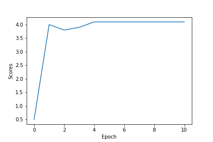
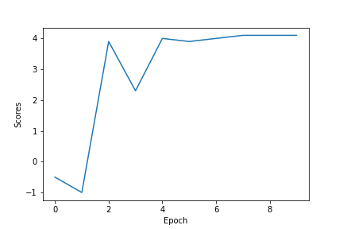
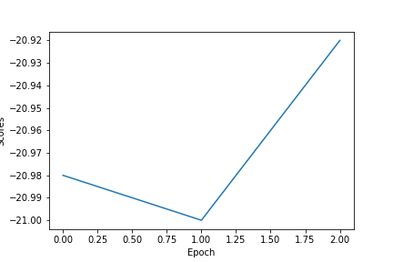
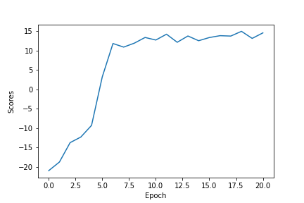

# RL2
Stanford - CS234 Reinforcement Learning - Assignment 2


## Introduction (from Assignment #2 paper)

In Pong, one player scores if the ball passes by the other player. An episode is over when one of the players
reaches 21 points. Thus, the total return of an episode is between -21 (lost every point) and +21 (won every
point). Our agent plays against a decent hard-coded AI player.


## Results on Test Environment (described in Assignment #2 paper)

### Linear Approximation
```
python q2_linear.py
```


### DeepMind's DQN
```
python q3_nature.py
```



## Results on Atari Pong Environment

### Linear
```
python q4_train_atari_linear.py
```



### DeepMind's DQN
```
python q5_train_atari_nature.py
```



## Python libraries

Numpy, TensorFlow, Gym, collections, pyglet, random, time, sys, loggings, matplotlib, os
